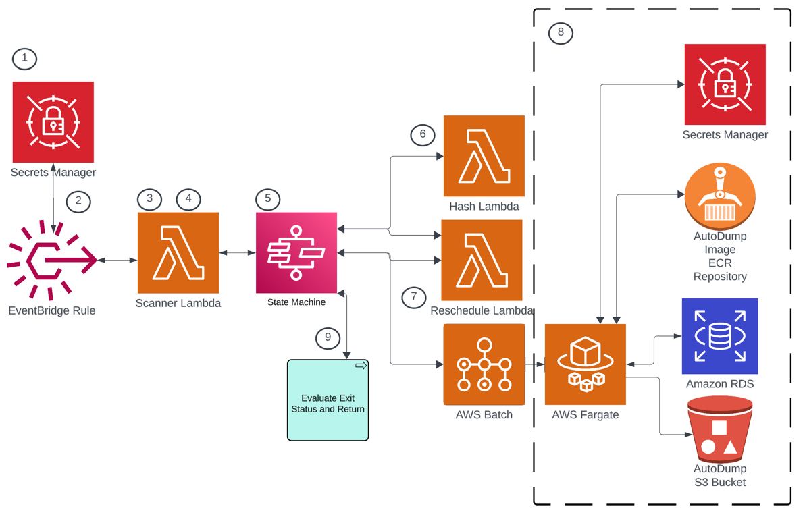

# AutoDump

This cdk project automates creation of services that dump a database to S3.

## How this works
AutoDump scans all secrets within an account, and looks for secrets that have autodump tags. If it finds any, it will fire a state machine execution that will dump the database to S3.


Step 1. The Scanner Lambda is scheduled to run daily at midnight UTC. It initiates the process by scanning all secrets within the account. It identifies which secrets are tagged for AutoDump scheduling.

Step 2. For each identified secret, the Lambda determines the appropriate schedule time and calculates the tag hash. This information is used to configure the execution parameters when firing the state machine execution in the next step.

Step 3. The state machine is triggered to start. It first enters a wait state until the scheduled time as calculated in Step 2. 

Step 4. After the wait state expires, the state machine fires the Hash Lambda to calculate the current tag hash value. 

Step 5. If the tag hash value is the same as the one calculated in Step 1, the state machine fires the AWS Batch job using AWS Fargate and an [image](https://github.com/truemark/autodump-docker) we created for this purpose. It is stored in ECR.

Step 6. The AWS Batch job runs the dump command, which intially stores the dumpfile locally, and then copies it to S3.

Step 7. The state machine evalutes the exit status of the AWS Batch job. 

## Creating an AutoDump secret

The secret value must have the values listed below.

| col1 | col2                                                                                                                                                                                                                                                  | 
|--|-------------------------------------------------------------------------------------------------------------------------------------------------------------------------------------------------------------------------------------------------------|
| username | The username of the database account that will execute the dump. This user must have the appropriate privileges granted within the database engine. This user can be named 'autodump', however the only limitations are those of the database engine. |
| password | The password of the database account. Limitations of database engine apply here also.                                                                                                                                                                 |
| databasename | The name of the database to export. The database must exist on the database server referenced in endpoint.                                                                                                                                            |
| endpoint | The RDS endpoint where the database resides.                                                                                                                                                                                                          |
| engine | The database engine. Currently only postgres is supported.                                                                                                                                                                                            |
| bucketname | The name of the bucket where dump files are stored.                                                                                                                                                                                                   |

Below is a screen shot of a sample AutoDump secret value.



## Supported Tags

| Tag                     | Description                                                                                                        |
|-------------------------|--------------------------------------------------------------------------------------------------------------------|
| autodump:timezone       | The timezone to use when interpreting schedules. Defaults to UTC. Example: America/Denver                          |
| autodump:start-schedule | The schedule as a cron expression to start the resource. Example: 0 8 * * 1-5      

## Useful commands

-   `npm run build` compile typescript to js
-   `npm run watch` watch for changes and compile
-   `npm run test` perform the jest unit tests
-   `cdk deploy` deploy this stack to your default AWS account/region
-   `cdk diff` compare deployed stack with current state
-   `cdk synth` emits the synthesized CloudFormation template

Install dependencies with pnpm. Example below

```agsl
bash-5.2$ pnpm add @aws-sdk/client-sfn
 WARN  Moving @types/node that was installed by a different package manager to "node_modules/.ignored"
 WARN  Moving aws-cdk that was installed by a different package manager to "node_modules/.ignored"
 WARN  Moving ts-jest that was installed by a different package manager to "node_modules/.ignored"
 WARN  Moving ts-node that was installed by a different package manager to "node_modules/.ignored"
 WARN  Moving jest that was installed by a different package manager to "node_modules/.ignored"
 WARN  6 other warnings

   ╭──────────────────────────────────────────────────────────────────╮
   │                                                                  │
   │                Update available! 8.6.12 → 8.12.1.                │
   │   Changelog: https://github.com/pnpm/pnpm/releases/tag/v8.12.1   │
   │                Run "pnpm add -g pnpm" to update.                 │
   │                                                                  │
   │      Follow @pnpmjs for updates: https://twitter.com/pnpmjs      │
   │                                                                  │
   ╰──────────────────────────────────────────────────────────────────╯

Packages: +381
++++++++++++++++++++++++++++++++++++++++++++++++++++++++++++++++++++++++++++++++++++++++++++++++++++++++++
Packages are hard linked from the content-addressable store to the virtual store.
  Content-addressable store is at: /Users/lisakoivu/Library/pnpm/store/v3
  Virtual store is at:             node_modules/.pnpm
Progress: resolved 381, reused 280, downloaded 101, added 381, done

dependencies:
+ @aws-sdk/client-sfn 3.476.0
+ @aws-sdk/util-arn-parser 3.465.0
+ aws-cdk-lib 2.92.0
+ constructs 10.3.0
+ source-map-support 0.5.21

devDependencies:
+ @types/jest 29.5.11
+ @types/node 20.4.10 (20.5.1 is available)
+ aws-cdk 2.92.0
+ jest 29.7.0
+ ts-jest 29.1.1
+ ts-node 10.9.2
+ typescript 5.1.6 (5.3.3 is available)

The integrity of 1110 files was checked. This might have caused installation to take longer.
Done in 7.5s

```

# A Note on Linting

ESLint is configured within this project. The rules are configured this way for a reason. The content of the following files are not to be modified without consulting Erik.

-   .eslintignore
-   .eslintrc.json
-   .prettierignore

# Reference

This [article](https://medium.com/tysonworks/manage-batch-jobs-with-aws-batch-1f91229b1b6e) has a largish code example. The full example is behind a Medium paywall.

# Notes
Below is a sample of the event from Event Bridge to Lambda. If needed, use this format to create a manual test configuration in Lambda.
```angular2html
{
    "input": "{\"stateMachineArn\": \"arn:aws:states:us-west-2:123456666789:stateMachine:AutoDump99630B31-aY2voyWGlOSc\"}"
}
```
