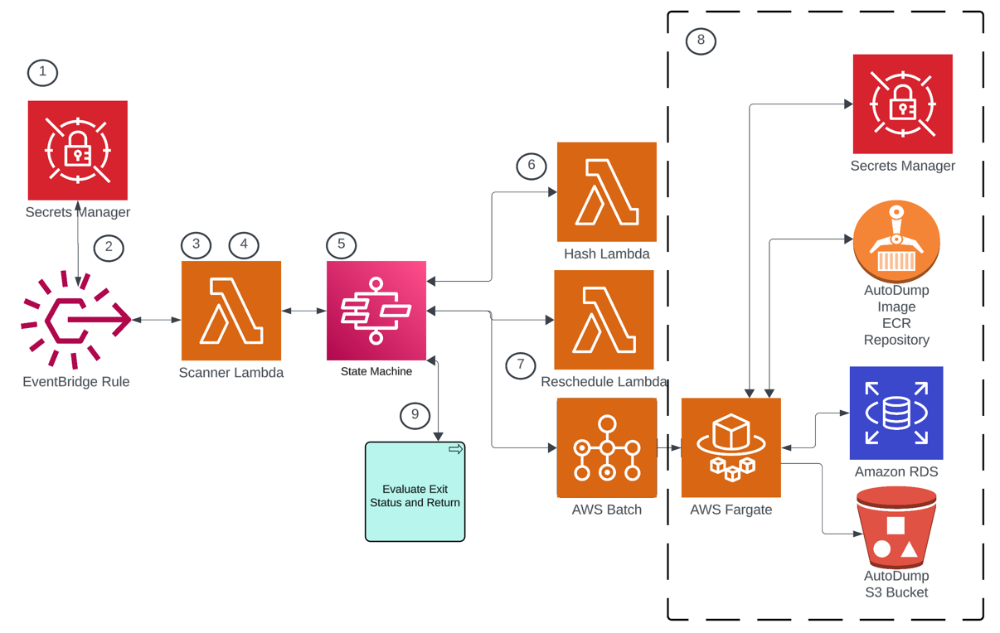
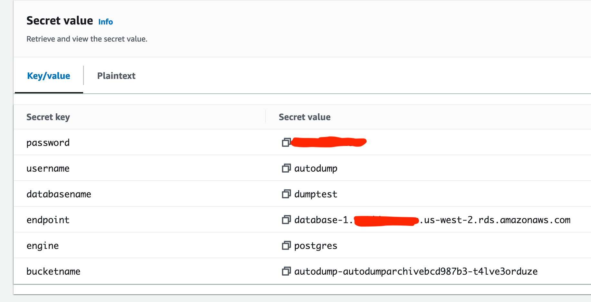

# AutoDump

This cdk project automates creation of services that dump a database to S3. It scans all secrets within an account looking for secrets that have autodump tags. If any are present, a state machine execution is scheduled that will dump the database referenced in the secret to S3.

## How to deploy

The following example command will deploy AutoDump using the private subnets and VPC specified.
Replace the IDs with the ones from your account.

```bash
cdk \
  -c vpcId=vpc-0a5fd51718cbc523a \
  -c "privateSubnetIds=subnet-08b42fcaa8530abaf,subnet-017d971130aaa412a" \
  -c "availabilityZones=us-west-2a,us-west-2b" \
  -c createReadOnlyUser=true \
  deploy
```

## How this works




Step 1. The process begins when a secret is created with the appropriate tags, or a secret is updated to include the tags (the tag schema is [here](#supported-tags)). These actions emit events on the default event bus.

Step 2. An EventBridge rule is triggered by the secret creation or update secret tag events. This rule triggers the Scanner Lambda.

Step 3. The Scanner Lambda scans all secrets within the account. It identifies which secrets are tagged for AutoDump scheduling.

Step 4. For each identified AutoDump secret, the Scanner Lambda determines the appropriate schedule time and calculates the tag hash. This information is used to configure the execution parameters during state machine execution in Step 6.

Step 5. The state machine is triggered to start. It first enters a wait state until the scheduled time as calculated in Step 4. 

Step 6. After the wait state expires, the Hash Lambda determines if the tags have changed since the task was scheduled. If the tags have not changed, execution continues. Otherwise, execution terminates gracefully.

Step 7. The Reschedule Lambda and Batch job fire in parallel. The Reschedule Lambda calculates the next execution time and schedules the next state machine execution. The state machine fires the Batch job using Fargate and a [docker image](https://github.com/truemark/autodump-docker) created for this purpose. The docker image is stored in ECR. The Secret ARN is passed in to the job as an environment variable, and the secret is only accessed within the Fargate job.

Step 8. The Fargate job runs the dump command, which initially stores the dumpfile locally, and then copies it to S3.

Step 9. The state machine evaluates the exit status of the Batch job and the Reschedule Lambda. If either fail, the state machine will report failure. If both succeed, the state machine will report success. 

## Creating an AutoDump secret

The secret value must have the values listed below.

| tag          | description                                                                                                                                                                                                                                           | 
|--------------|-------------------------------------------------------------------------------------------------------------------------------------------------------------------------------------------------------------------------------------------------------|
| username     | The username of the database account that will execute the dump. This user must have the appropriate privileges granted within the database engine. This user can be named 'autodump', however the only limitations are those of the database engine. |
| password     | The password of the database account. Limitations of database engine apply here also.                                                                                                                                                                 |
| databasename | The name of the database to export. The database must exist on the database server referenced in endpoint.                                                                                                                                            |
| endpoint     | The RDS endpoint where the database resides.                                                                                                                                                                                                          |
| engine       | The database engine. Currently only postgres is supported.                                                                                                                                                                                            |
| bucketname   | The name of the bucket where dump files are stored.                                                                                                                                                                                                   |

Below is a screen shot of a sample AutoDump secret value.


## Supported Tags

| Tag                     | Description                                                                                                        |
|-------------------------|--------------------------------------------------------------------------------------------------------------------|
| autodump:timezone       | The timezone to use when interpreting schedules. Defaults to UTC. Example: America/Denver                          |
| autodump:start-schedule | The schedule as a cron expression to start the resource. Example: 0 8 * * 1-5      

## Limitations
The cron cannot schedule a job to run every minute. This is because the cron logic bumps the time ahead one minute within the optionalCron function within the scanner function code (see code below). This is not a problem considering a database dump is not something that would be useful if executed every minute. 

```
      currentDate: new Date(Date.now() + 60000), // look 1 minute in the future to be safe
```

## Useful commands

-   `npm run build` compile typescript to js
-   `npm run watch` watch for changes and compile
-   `npm run test` perform the jest unit tests
-   `cdk deploy` deploy this stack to your default AWS account/region
-   `cdk diff` compare deployed stack with current state
-   `cdk synth` emits the synthesized CloudFormation template

Install dependencies with pnpm. Example below

```agsl
bash-5.2$ pnpm add @aws-sdk/client-sfn
 WARN  Moving @types/node that was installed by a different package manager to "node_modules/.ignored"
 WARN  Moving aws-cdk that was installed by a different package manager to "node_modules/.ignored"
 WARN  Moving ts-jest that was installed by a different package manager to "node_modules/.ignored"
 WARN  Moving ts-node that was installed by a different package manager to "node_modules/.ignored"
 WARN  Moving jest that was installed by a different package manager to "node_modules/.ignored"
 WARN  6 other warnings

   ╭──────────────────────────────────────────────────────────────────╮
   │                                                                  │
   │                Update available! 8.6.12 → 8.12.1.                │
   │   Changelog: https://github.com/pnpm/pnpm/releases/tag/v8.12.1   │
   │                Run "pnpm add -g pnpm" to update.                 │
   │                                                                  │
   │      Follow @pnpmjs for updates: https://twitter.com/pnpmjs      │
   │                                                                  │
   ╰──────────────────────────────────────────────────────────────────╯

Packages: +381
++++++++++++++++++++++++++++++++++++++++++++++++++++++++++++++++++++++++++++++++++++++++++++++++++++++++++
Packages are hard linked from the content-addressable store to the virtual store.
  Content-addressable store is at: /Users/lisakoivu/Library/pnpm/store/v3
  Virtual store is at:             node_modules/.pnpm
Progress: resolved 381, reused 280, downloaded 101, added 381, done

dependencies:
+ @aws-sdk/client-sfn 3.476.0
+ @aws-sdk/util-arn-parser 3.465.0
+ aws-cdk-lib 2.92.0
+ constructs 10.3.0
+ source-map-support 0.5.21

devDependencies:
+ @types/jest 29.5.11
+ @types/node 20.4.10 (20.5.1 is available)
+ aws-cdk 2.92.0
+ jest 29.7.0
+ ts-jest 29.1.1
+ ts-node 10.9.2
+ typescript 5.1.6 (5.3.3 is available)

The integrity of 1110 files was checked. This might have caused installation to take longer.
Done in 7.5s

```

# A Note on Linting

ESLint is configured within this project. The rules are configured this way for a reason. The content of the following files are not to be modified without consulting Erik.

-   .eslintignore
-   .eslintrc.json
-   .prettierignore

# Reference

This [article](https://medium.com/tysonworks/manage-batch-jobs-with-aws-batch-1f91229b1b6e) has a largish code example. The full example is behind a Medium paywall.

